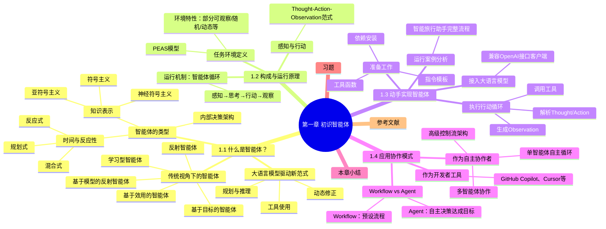

## 1.1、什么是智能体

> 定义：在人工智能领域，智能体被定义为任何能够通过传感器（Sensors）感知其所处环境（Environment），并自主地通过**执行器（Actuators）采取行动（Action）**以达成特定目标的实体。

四要素：

* 环境：道路交通之于自动驾驶，金融市场之于交易算法
* 传感器：摄像头，雷达，API
* 执行器：机械臂，方向盘，代码
* 自主性（真正赋予智能体智能）：智能体并非只是被动响应外部刺激或严格执行预设指令的程序，它能够基于其感知和内部状态进行独立决策，以达成其设计目标。

这种从感知到行动的闭环，构成了所有智能体行为的基础


### 1.1.1、传统视角下的智能体

在当前**大语言模型（Large Language Model, LLM）** 前，已经有了**传统智能体**


| 特点     | 简单反射智能体                 | 基于模型的反射智能体                        | 基于目标的智能体             | 基于效用的智能体                 | 学习型智能体                              |
| -------- | ------------------------------ | ------------------------------------------- | ---------------------------- | -------------------------------- | ----------------------------------------- |
| 核心依赖 | 仅当前感知 + 条件 - 动作规则   | 当前感知 + 内部世界模型 + 反射规则          | 当前感知 + 世界模型 + 目标   | 当前感知 + 世界模型 + 效用函数   | 性能元件 + 学习元件 + 环境反馈            |
| 记忆能力 | 无（不存储历史状态）           | 有（存储历史状态，追踪不可见信息）          | 有（存储目标与路径信息）     | 有（存储多目标权重与状态效用）   | 有（存储经验与学习到的策略）              |
| 推测能力 | 无（仅反应当前输入）           | 有（推测不可直接观测的环境状态）            | 有（推测行动对目标的影响）   | 有（推测不同行动的效用结果）     | 有（推测最优行动策略）                    |
| 规划能力 | 无（无长远思考，即时反应）     | 无（仅基于当前 + 历史状态反应，无目标规划） | 有（规划达成目标的行动序列） | 有（规划最大化效用的行动序列）   | 有（通过学习优化长期行动策略）            |
| 目标特性 | 无明确目标（仅响应规则）       | 无明确目标（仅维持状态认知）                | 单一明确目标                 | 多目标权衡（效用优先）           | 动态目标（通过奖励信号优化）              |
| 适应环境 | 完全可观察、静态、简单环境     | 部分可观察、动态环境                        | 复杂、序贯环境               | 多约束、冲突目标环境             | 未知、动态、复杂环境                      |
| 典型例子 | 恒温器、红绿灯自动控制、自动门 | 隧道中的自动驾驶汽车、避障机器人            | GPS 导航、路径规划机器人     | 智能理财顾问、多目标优化调度系统 | AlphaGo、强化学习游戏 AI、推荐系统        |
| 核心优势 | 结构简单、响应速度快、成本低   | 能处理部分不可见信息，鲁棒性更强            | 目标导向明确，行动有针对性   | 多目标决策更理性，贴近人类选择   | 无需人工预设规则，可自主进化              |
| 核心局限 | 环境变化即失效，无灵活性       | 无目标导向，无法应对需规划的任务            | 无法处理多目标冲突           | 效用函数设计复杂，依赖人工调优   | 学习成本高、需大量数据 / 反馈、训练周期长 |

为什么他们都是传统智能体：

1. 靠**人工设计**的规则、模型、目标、效用函数、学习算法

2. 不是靠大语言模型（LLM）做 “大脑”

3. 是 **LLM 出现之前** 的主流智能体范式


### 1.1.2、大语言模型驱动的新范式

以**GPT（Generative Pre-trained Transformer）**为代表的大语言模型，在显著改变智能体的构建方法与能力边界。由大语言模型驱动的 LLM 智能体，其核心决策机制与传统智能体存在本质区别。

| 对比维度      | 传统智能体                       | LLM 驱动的智能体                 |
| ------------- | -------------------------------- | -------------------------------- |
| 核心引擎      | 基于显式编程的逻辑系统           | 基于预训练模型的推理引擎         |
| 知识来源      | 工程师预定义的规则、算法、知识库 | 从海量非结构化数据中间接学习内化 |
| 处理指令      | 需结构化、精确的命令             | 可理解高层级、模糊的自然语言     |
| 工作模式      | 确定性的、可预测的               | 概率性的、生成式的               |
| 泛化 / 适应性 | 弱，局限于预设框架               | 强，具备强大的涌现能力和泛化能力 |
| 开发范式      | 规则设计、算法编程、知识工程     | 模型训练、提示工程、微调         |

 **LLM 智能体特点**

1. **规划与推理**：把大任务拆成子任务
2. **工具使用**：主动调用外部工具补全信息
3. **动态修正**：根据反馈调整行为


### 1.1.3、智能体的类型

1. 基于内部决策架构分类（最经典）：1.1.1中的五种

   1. 简单反射智能体
   2. 基于模型的反射智能体
   3. 基于目标的智能体
   4. 基于效用的智能体
   5. 学习型智能体

2. 按时间与反应性分类

   1. 反应式智能体（Reactive Agents）：反应快、不做长远思考、不规划未来：如安全气囊，恒温器
   2. 规划式智能体（Deliberative Agents）：先思考、再行动，会推演未来、会做规划、适合复杂任务：GPS 导航、下棋 AI、旅行规划
   3. 混合式智能体（Hybrid Agents）：反应 + 规划 结合：例子：智能旅行助手、自动驾驶系统

3. 基于知识表示的分类

   

   1. ==符号主义AI（Symbolic AI）==：常被称为传统人工智能，其核心信念是：智能源于对符号的逻辑操作。这里的符号是人类可读的实体（如词语、概念），操作则遵循严格的逻辑规则

      1. 特点：可解释、知识是显式的（人能读、能改、能调试）、靠逻辑推理、必须**人手工写规则**
      2. 优点：透明，可解释，推理步骤明确
      3. 缺点：现实世界太复杂，规则写不完，知识获取是有瓶颈的
      4. 例子：专家系统、传统编程系统、传统智能体（1.1.1那种）

   2. ==亚符号主义 AI（Sub-symbolic AI）==：不用符号、不用规则，知识藏在神经网络里，是黑箱。

      1. 解释：不用 “词语、符号、规则” 来表示知识，而是用 “神经网络里的数值、权重、分布” 来存知识

      2. 符号主义：知识是 **if…then… 规则**

         亚符号主义：知识是 **神经网络里的一堆数字（权重）**

      3. 我们用**认猫**举例：

         符号主义认猫（人写规则）

         ```
         如果 有四条腿
         并且 有毛
         并且 有耳朵
         并且 会喵喵叫
         → 是猫
         ```

          亚符号主义认猫（神经网络学）

         - 喂它 10000 张猫的图片
         - 网络自动调整内部权重
         - 学到**猫的视觉模式**
         - 看到新图片 → 匹配模式 → 输出 “猫”

         **它不知道 “猫” 这个符号，只知道模式。**

      4. 典型代表：深度学习、神经网络、大语言模型（LLM）→ 最典型代表

   3. ==**神经符号主义 AI（Neuro-Symbolic AI）**==:神经符号主义 AI = 符号主义 AI + 亚符号主义 AI 的结合体:它同时拥有：神经网络的**直觉、学习、感知能力**\符号系统的**推理、规划、解释能力**

      1. 为什么神经符号主义AI会出现：符号主义：**能推理、可解释，但太死板、要手写规则**；亚符号主义：**能学习、很灵活，但黑箱、不可解释、会幻觉**。二者都有致命缺陷

      2. 类比丹尼尔-卡尼曼（《思考，快与慢》）：

         1. **系统 1**是快速、凭直觉、并行的思维模式，类似于亚符号主义 AI 强大的模式识别能力。对应LLM底层神经网络

         2. **系统 2**是缓慢、有条理、基于逻辑的审慎思维，恰如符号主义 AI 的推理过程。智能体的思考、计划、步骤

         3. 神经符号主义 = 系统 1 + 系统 2 一起工作，==**人类的智能就是这样来的**==，现代AI智能体也是这样工作的

      3. 为什么LLM 智能体是最典型的神经符号系统？（重点）
         1. LLM 底层 = 亚符号（神经网络）
         2. LLM 智能体运行时 = 符号行为，会显式输出：Thought、Plan、Action
         3. 合在一起：LLM 智能体 = 亚符号感知 + 符号推理 = 神经符号主义
      4. 典型代表：LLM智能体、能思考、能规划、能调用工具的大模型系统

### 1.1.4、==那么，到底什么是智能体呢==

现在大家讨论的智能体，一般都指的是AI智能体，即LLM智能体

==**一句话解释：**==

> 现在大家说的 “智能体”，就是一个**有脑子、会思考、能自己干活的 AI。它不是只会聊天，而是能理解你的目标 → 自己规划步骤 → 自己查资料、用工具 → 帮你把事情做完 **。

==**超通俗展开版（像聊天一样讲）**==

> 以前的 AI 就是**聊天机器人**，你问一句它答一句，不会主动做事。
>
> 现在的 **LLM 智能体**不一样：
>
> 它更像一个**真正的助手**。
>
> 比如你说：
>
> **“帮我规划一趟厦门旅行。”**
>
> 它不会只给你一句话，而是会：
>
> 1. **听懂你的目标**
> 2. **自己拆步骤**：先查天气 → 再查景点 → 再安排行程 → 再看酒店
> 3. **自己调用工具**：查天气、搜地图、看价格
> 4. **最后直接给你结果**
>
> 全程**不用你一步步指挥，它自己思考、自己干**。

==**最精炼、最好记的 3 句总结**==

> 1. **智能体 = 有目标、会思考、能自己干活的 AI。**
> 2. **以前的 AI 只会 “回答”，现在的智能体会 “做事”。**
> 3. **它就像你的私人助理，你说目标，它帮你从头到尾搞定。**


## 1.2、智能体的构成与运行原理

这一节只讲三件事：

1. **智能体在什么环境里干活？**（1.2.1 任务环境 PEAS 模型）
2. **智能体是怎么一步步干活的？**（1.2.2 智能体循环）
3. **智能体和环境怎么 “说话”？**（1.2.3 感知与行动的结构化协议）

### 1.2.1、任务环境定义：PEAS 模型

要设计 / 理解一个智能体，**必须先定义它的任务环境**，一般来说，行业标准工具就是 **PEAS 模型**：

- **P**erformance：性能度量（怎么算做得好）
- **E**nvironment：环境（它在什么世界里）
- **A**ctuators：执行器（它能做什么动作）
- **S**ensors：传感器（它能看到什么信息）

以书中「智能旅行助手」为例，直接对应 PEAS

1. **Performance（性能度量）**

   推荐景点准确、符合天气 / 预算、步骤少、信息全、用户满意。

2. **Environment（环境）**

   天气数据、景点信息、票务数据、用户对话、网络 API 等数字环境。

3. **Actuators（执行器）**

   调用天气 API、搜索景点、回复用户、生成行程。

4. **Sensors（传感器）**

   用户输入、API 返回数据、网页信息、工具执行结果。

#### 附1：==为什么要用PEAS模型来定义智能体的任务环境（重要）==

PEAS 不是用来背的，**是用来防止你把智能体做废、做偏、做出来没法用**的。

没有 PEAS，你根本不知道「智能体该做成什么样」

假如现在让你做一个**智能健身教练智能体**，你上来就写代码，一定会崩：

- 它要干嘛？
- 它能看到什么？
- 它能做什么？
- 怎么算它合格？

你全是模糊的。

但你用 **PEAS 一过脑**，思路瞬间清晰：

1. **P（绩效）**：心率安全、计划合理、动作指导准确、用户能坚持
2. **E（环境）**：用户家里 / 健身房、可穿戴设备数据、运动视频、用户语音
3. **A（执行器）**：语音提醒、调整计划、发动作视频、给饮食建议
4. **S（传感器）**：心率数据、动作摄像头、用户说的话、历史运动记录

**PEAS 就是智能体的「岗位说明书 + 工作条件 + KPI + 权限表」**

- 不知道要做什么 → 看 P
- 不知道在哪干活 → 看 E
- 不知道能动手干嘛 → 看 A
- 不知道能看到什么 → 看 S

你以后**不管做任何智能体：自动驾驶、AI 客服、机器人、AutoGPT**，

第一件事永远是：

**先写 PEAS！**

写不出来，就说明你根本没搞懂要做什么。


#### 附2：manus的PEAS分析

Manus.ai是中国团队Monica推出的**通用型自主AI智能体**，核心定位是“连接思想与行动”——不只是聊天给建议，而是**独立完成复杂任务并交付完整成果**。下面用PEAS框架把它的设计、能力、边界讲透，你会发现PEAS就是它的“产品说明书+能力边界+验收标准”。

一、P = Performance（绩效标准：怎么算Manus做得好）

Manus的“KPI”不是空泛的“智能”，而是**可量化的任务交付指标**：

| 维度 | 具体指标 | 说明 |
|------|----------|------|
| **任务完成率** | 100%交付完整成果 | 不是“给建议”，而是直接给最终文件/结果（如完整报告、网站、分析表） |
| **准确性** | 数据正确率、代码无错率、逻辑一致性 | 比如股票分析数据误差<1%，生成代码可直接运行 |
| **效率** | 任务耗时比人工快5-10倍 | 24小时不间断工作，多任务并行处理 |
| **自主性** | 人工干预次数<1次/复杂任务 | 不需要用户一步步指导，自主规划执行路径 |
| **适应性** | 新任务学习周期<24小时 | 能快速理解新领域需求，调整执行策略 |
| **安全性** | 零数据泄露、零恶意操作 | 运行在独立虚拟机/沙箱，严格权限控制 |

**为什么P很重要**：没有这些指标，用户只会说“Manus很厉害”，但没法判断它到底值不值钱。有了P，就能**客观评估**它在金融分析、简历筛选、旅行规划等具体场景的价值。

二、E = Environment（环境：Manus在哪里“干活”）

Manus的“工作世界”是**数字空间**，有明确的约束和特点：

1. 物理载体

- 云端虚拟机/沙箱环境（独立运行，不影响用户本机）
- 支持浏览器扩展、桌面应用、API接入等多形态

2. 环境组成

- 数字工具：浏览器、代码编辑器、Excel、PPT、数据库、API接口
- 信息源：互联网、用户上传文件、企业内部系统（需授权）
- 协作对象：用户、其他AI工具、企业软件（如CRM、ERP）

3. 环境关键特点（决定Manus的能力边界）

- **部分可观察**：看不到用户本地未授权文件，只能访问授权数据
- **动态变化**：网页内容实时更新、数据随时变化（如股票价格）
- **多智能体共存**：和用户、其他AI、系统服务同时操作同一资源
- **有物理约束**：受网络速度、API调用限制、计算资源影响

**为什么E很重要**：Manus不是“全知全能”，它的能力被环境严格限定。比如它能分析公开股票数据，但**不能获取用户未授权的银行账户信息**；能操作浏览器，但**不能控制用户的物理设备**（如打印机）。

三、A = Actuators（执行器：Manus能“动手”做什么）

Manus的“手脚”是**数字操作能力**，不是物理机械臂，而是对软件/工具的精准控制：

核心执行能力

1. **浏览器操作**：自动打开网页、搜索、填写表单、爬取数据、点击按钮
2. **代码能力**：编写/调试/执行多语言代码（Python/Java/JS等），在沙箱运行
3. **文档处理**：创建/编辑Excel/Word/PPT，设置格式、公式、图表
4. **数据操作**：查询数据库、清洗数据、可视化分析、生成报表
5. **工具调用**：动态选择API、插件、第三方服务（如地图、支付、翻译）
6. **文件管理**：创建/保存/导出文件，按用户要求整理归档

**执行边界**：Manus的A（执行器）严格限定在**数字操作**——不能“拿”物理物品，不能“说话”（只能输出文字/文件），不能“看”物理世界（除非通过摄像头API授权）。这就是PEAS帮你划清的“能做/不能做”红线，避免不切实际的期望。

四、S = Sensors（传感器：Manus能“感知”到什么）

Manus的“五官”是**数字信息输入通道**，决定它能获取什么数据：

| 传感器类型 | 具体能力 | 数据来源 |
|------------|----------|----------|
| **文本输入** | 理解用户自然语言指令 | 聊天框、上传的文档、邮件内容 |
| **视觉识别** | 解析图片、PDF、界面元素 | 用户上传图片、网页截图、文档中的图表 |
| **数据读取** | 解析表格、数据库、API返回 | Excel文件、SQL数据库、JSON/XML接口 |
| **状态感知** | 监控任务进度、工具响应 | 代码运行日志、网页加载状态、API返回码 |
| **反馈接收** | 理解用户评价和修改意见 | 聊天反馈、文件批注、评分系统 |

**感知边界**：Manus没有“第六感”——**只能获取授权的数字信息**。比如它能读你上传的销售数据，但不能“猜”你没提供的成本数据；能看公开网页，但不能“看”你本地加密文件。


==PEAS帮你看清Manus的核心价值（为什么它和ChatGPT不一样）==

用PEAS对比，你会发现Manus的革命性：

| 对比项 | Manus.ai（AI智能体） | ChatGPT（生成式AI） | 关键差异 |
|--------|----------------------|---------------------|----------|
| **P（绩效）** | 交付完整任务成果 | 提供文本建议 | Manus是“执行者”，ChatGPT是“顾问” |
| **E（环境）** | 能在数字环境主动操作 | 只能在聊天框内互动 | Manus能“走出去”用工具，ChatGPT被限制在对话里 |
| **A（执行器）** | 控制浏览器/代码/文档 | 只能生成文字 | Manus有“动手能力”，ChatGPT只有“说话能力” |
| **S（传感器）** | 主动获取多源数字信息 | 被动接收用户输入 | Manus能“主动找数据”，ChatGPT只能“等你喂数据” |

==PEAS的实际用处：用它判断Manus能做/不能做什么==

当你纠结“Manus能不能帮我做XX”时，用PEAS快速判断：

例子1：Manus能帮我做“竞品分析报告”吗？

- P：能交付完整报告（含数据、图表、结论）→ 符合
- E：能访问互联网、操作浏览器、用Excel → 符合
- A：能搜索竞品信息、整理数据、生成图表 → 符合
- S：能读取网页数据、解析表格、理解用户需求 → 符合
→ **结论：能做，且能直接给最终报告**

例子2：Manus能帮我“给客户打电话沟通需求”吗？

- P：沟通效果好 → 理论可行，但
- E：没有电话接口（环境不支持）→ 不符合
- A：没有语音输出/输入能力（执行器缺失）→ 不符合
- S：不能听客户说话、不能说人话（传感器缺失）→ 不符合
→ **结论：不能做，因为E/A/S都不支持**

例子3：Manus能帮我“自动处理简历筛选并通知候选人”吗？

- P：筛选准确率>90%，自动发邮件 → 符合
- E：能访问招聘网站、邮箱系统（需授权）→ 符合
- A：能下载简历、解析内容、对比JD、发送邮件 → 符合
- S：能读取PDF简历、理解JD要求、接收系统反馈 → 符合
→ **结论：能做，且能24小时不间断处理**

==终极价值：PEAS让Manus的设计不“跑偏”==

Manus团队在开发时，一定先写了PEAS：
1. **明确目标**：P决定了它要“交付完整成果”，而不是“给建议”
2. **限定范围**：E/A/S决定了它专注**数字世界操作**，不碰物理世界
3. **避免冗余**：不会开发“打电话”“控制机器人”等超出E/A/S的功能
4. **可评估**：用P的指标（完成率、准确率、效率）判断产品迭代方向

==一句话总结==

**Manus.ai的PEAS就是它的“数字劳动力岗位说明书”**：
- 要做什么（P）：交付完整任务成果
- 在哪里做（E）：云端数字环境
- 能用什么工具（A）：浏览器、代码、文档、API
- 能获取什么信息（S）：文本、数据、界面、反馈


### 1.2.2、智能体的运行机制（**Agent Loop**）

智能体并非一次性完成任务，而是通过一个持续的循环与环境进行交互，这个核心机制被称为 **智能体循环 (Agent Loop)**。


感知 → 思考 → 行动 → 观察 → 再感知…… 无限循环，直到完成目标。

==四步循环逐句拆解==

1. **感知（Perception）**

   智能体通过**传感器**拿到环境信息，叫 **Observation（观察）**。

   例：用户说 “帮我查北京今天天气”。

2. **思考（Thought）**

   LLM 当大脑，做两件事：

   - **规划**：把大任务拆成小步骤

     例：先查天气 → 再推荐景点

   - **工具选择**：决定下一步用哪个工具、传什么参数

     例：调用 get_weather (“北京”)

3. **行动（Action）**

   用**执行器**真的去做，改变环境状态。

   例：调用天气 API，获取气温、晴雨。

4. **观察（Observation）**

   例：API 返回 “北京晴，26℃”。

   智能体的行动会引起**环境 (Environment)** 的**状态变化 (State Change)**，环境随即会产生一个新的**观察 (Observation)** 作为结果反馈。这个新的观察又会在下一轮循环中被智能体的感知系统捕获，形成一个持续的“感知-思考-行动-观察”的闭环。智能体正是通过不断重复这一循环，逐步推进任务，从初始状态向目标状态演进。

### 1.2.3、智能体的感知与行动

LLM 智能体不是靠 “随便聊天” 和环境交互的，而是靠一套固定格式 = TAO 协议（Thought-Action-Observation），让 “大脑思考” 和 “动手干活” 能精准对接。


## 1.3 动手体验：5 分钟实现第一个智能体

见 `travel_agent.py`

> 简单介绍一下其中用到的Tavily：
>
> `Tavily` 是一个**专为 AI 智能体（AI Agents）设计的搜索 API 服务**，而 `tavily-python` 是其官方 Python SDK。它区别于普通搜索引擎的核心优势是：**返回的结果已经过 LLM 优化处理，可直接用于 RAG（检索增强生成）**。

## 1.4、智能体应用的协作模式

智能体的协作方式主要有两种：

1. 作为高效工具，深度融入我们的工作流：如**Claude Code**、**Cursor**
2. 作为自主的协作者，与其他智能体协作完成复杂目标。智能体会像一个真正的项目成员一样，独立地进行规划、推理、执行和反思，直到最终交付成果。几个主流方向：
   1. **单智能体自主循环**：如 **AgentGPT** 所代表的模式。其核心是一个通用智能体通过“思考-规划-执行-反思”的闭环，不断进行自我提示和迭代，以完成一个开放式的高层级目标。
   2. **多智能体协作**（当前主流）：模拟**人类团队分工**，多个智能体互相配合完成复杂任务
      1. 角色扮演式对话：给智能体定角色（如产品经理+程序员），如camel
      2. 组织化工作流：模拟公司 / 团队，有明确分工、标准流程（SOP），直接产出完整成果（代码、报告、方案）。如metaGPT
      3. 灵活对话网络：不固定流程，开发者自由设计智能体之间的交互关系，灵活度极高。如AutoGen
   3. 高级控制流架构（工程化更强）：如 **LangGraph** 等框架


==workflow和智能体的区别==：

**Workflow 是让 AI 按部就班地执行指令，而 Agent 则是赋予 AI 自由度去自主达成目标。**


## 本章思维导图




